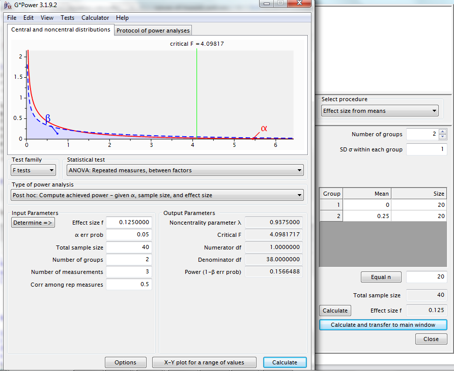
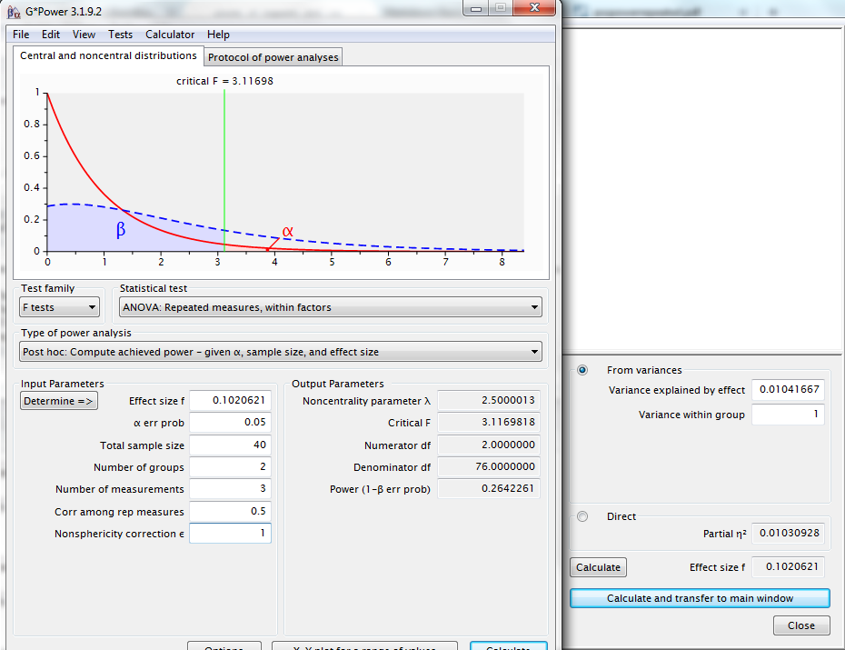
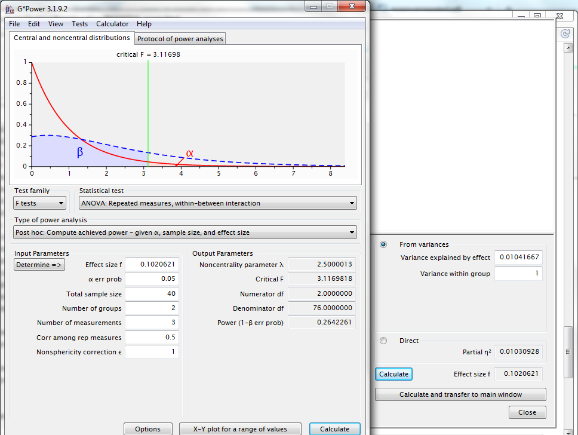

In repeated measures ANOVA with more than one group, there are typically three effects of interest: a within-subjects factor (typically time), a between-subjects factor (treatment or group), and the interaction of these two factors. 

Typically, there is an assumed correlation between the measures within a subject across timepoints. Let's examine an example with two groups, three timepoints, and a correlation of 0.5 across timepoints. First, let's consider the null scenario of no time effect and no group effect with two groups of 20 subjects each.

```{r}
library(MASS)
Sigma <- matrix(c(1,.5,.5,.5,1,.5,.5,.5,1), 3, 3)
mu <- c(0,0,0)
x <- mvrnorm(n = 40, mu, Sigma)
y <- as.vector(x)
time <- c(rep(1, 40), rep(2, 40), rep(3, 40))
subj <- rep(1:40, 3)
grp <- subj %% 2
subj <- factor(subj)
grp <- factor(grp)
time <- factor(time)


rmdat <- cbind(subj, grp, time, y)
summary(aov(y ~ time*grp + Error(subj)))
```

We can simulate 1000 null datasets and, for each effect, look at distribution of p-values for each effect.

```{r, cache = TRUE}
pval.grp <- rep(NA, 1000)
pval.time <- rep(NA, 1000)
pval.int <- rep(NA, 1000)

for (i in 1:1000){
  set.seed = i*123
  x <- mvrnorm(n = 40, mu, Sigma)
  y <- as.vector(x)
  rmdat <- data.frame(subj, grp, time, y)
  res <- unlist(summary(aov(y ~ time*grp + Error(subj), data = rmdat)))
  pval.int[i] <- res['Error: Within.Pr(>F)2']
  pval.time[i] <- res['Error: Within.Pr(>F)1']
  pval.grp[i] <- res['Error: subj.Pr(>F)1']
}
```
```{r, echo=FALSE}
par(mfrow = c(1,3))
hist(pval.time)
hist(pval.grp)
hist(pval.int)
```

Consider the means in one group to be 0.25 SD above the means in the other group. We can run a simulation to estimate our power to detect a group effect with n = 20 per group in this scenario.

```{r, cache = TRUE}
pval <- rep(NA, 1000)
set.seed(5324)
for (i in 1:1000){
  mu1 <- c(0,0,0)
  mu2 <- c(.25,.25,.25)
  x1 <- mvrnorm(n = 20, mu1, Sigma)
  x2 <- mvrnorm(n = 20, mu2, Sigma)
  y <- c(as.vector(x1), as.vector(x2))
  time <- rep(c(rep(1, 20), rep(2, 20), rep(3, 20)), 2)
  subj <- c(rep(1:20, 3), rep(21:40, 3))
  grp <- c(rep(0, 60), rep(1, 60))
  time <- factor(time)
  grp <- factor(grp)
  subj <- factor(subj)
  rmdat <- data.frame(subj, grp, time, y)
  res <- unlist(summary(aov(y ~ grp + Error(subj), data = rmdat)))
  pval[i] <- res['Error: subj.Pr(>F)1']
}

mean(pval<=.05)

```

This is similar to the power calculated by G*Power for this sample size, effect size, alpha, and correlation between timepoints. 

Let us add in a time effect and then evaluate the within-group and interaction effects.

```{r, cache = TRUE}
pval.time <- rep(NA, 1000)
pval.int <- rep(NA, 1000)
set.seed = 9284738
for (i in 1:1000){
  mu1 <- c(0,0,0)
  mu2 <- c(.25,.5,.75)
  x1 <- mvrnorm(n = 20, mu1, Sigma)
  x2 <- mvrnorm(n = 20, mu2, Sigma)
  y <- c(as.vector(x1), as.vector(x2))
  time <- rep(c(rep(1, 20), rep(2, 20), rep(3, 20)), 2)
  subj <- c(rep(1:20, 3), rep(21:40, 3))
  grp <- c(rep(0, 60), rep(1, 60))
  time <- factor(time)
  grp <- factor(grp)
  subj <- factor(subj)
  rmdat <- data.frame(subj, grp, time, y)

  res1 <- unlist(summary(aov(y ~ time + Error(subj), data = rmdat)))
  pval.time[i] <- res1['Error: Within.Pr(>F)1']

  res2 <- unlist(summary(aov(y ~ grp*time + Error(subj), data = rmdat)))
  pval.int[i] <- res2['Error: Within.Pr(>F)2']
}

mean(pval.time<=.05)
mean(pval.int<=.05)

```
To calculate the effect size of time, we can start from the matrix of cell means and subtract the means across time:
```{r}
cellmeans <- matrix(c(0,0,0,.25,.5,.75), ncol = 2)
timemeans <- apply(cellmeans, 1, mean)
mean((mean(cellmeans) - timemeans)**2)
```
In G*Power, this is the "Variance explained by the effect".The "Variance within group" is 1, based on the diagonal of the Sigma matrix.


To calculate the effect size of time*grp, we can look at the variability remaining in the cell means after subtracting the effects of time and group:
```{r}
grpmeans = apply(cellmeans, 2, mean)
cellmeans2 = t(t(cellmeans) - grpmeans)
timemeans = apply(cellmeans2, 1, mean)
cellmeans3 = cellmeans2 - timemeans
mean((cellmeans3)**2)
```
In G*Power, this is the "Variance explained by the effect". Again, the "Variance within group" is 1, based on the diagonal of the Sigma matrix.


These simulations offer a starting framework for repeated-measures MANOVA that are consistent with standard power calculations. These scenarios can be modified (group sizes, correlation structures, attrition over time) and the power simulations rerun for power estimates under the given data assumptions.

For example, I've revised the code to reflect the cellmeans and covariance matrix in [Stata's powerrepeated documentation](http://www.stata.com/manuals13/psspowerrepeated.pdf). The scenario below should yield about 80% power.

```{r, cache = TRUE}
Sigma <- matrix(c(225,157.5,157.5,157.5,225,157.5,157.5,157.5,225), 3, 3)
mu1 <- c(145,135,130)
mu2 <- c(145,130,120)

pval.int <- rep(NA, 1000)
set.seed = 39854
for (i in 1:1000){
  x1 <- mvrnorm(n = 27, mu1, Sigma)
	x2 <- mvrnorm(n = 27, mu2, Sigma)
	y <- c(as.vector(x1), as.vector(x2))
	time <- rep(c(rep(1, 27), rep(2, 27), rep(3, 27)), 2)
	subj <- c(rep(1:27, 3), rep(28:54, 3))
	grp <- c(rep(0, 81), rep(1, 81))
	time <- factor(time)
	grp <- factor(grp)
	subj <- factor(subj)
	rmdat <- data.frame(subj, grp, time, y)

	res2 <- unlist(summary(aov(y ~ grp*time + Error(subj), data = rmdat)))
  	pval.int[i] <- res2['Error: Within.Pr(>F)2']
}

mean(pval.int<=.05)
```


